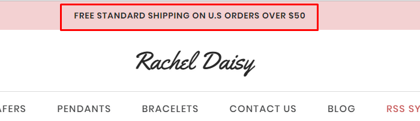

# Customization

This page will explain all configuration available and how to edit each section appear on theme. Let's view the first homepage.


## Top Banner



The top banner can be showed / edited in admin page > __Marketing__ > __Banners__. When you add / edit remember to choose __Location__ is __Top of Page__.

### Colors Customization

To customize colors of this section, go to admin page > __Storefront Design__ > __My Themes__, click button __Customize__ of the current theme to open the Theme Editor. 


Look into the options showing below:


## Header

### Header Styles
This theme support 3 different header styles:
- Logo at left
- Logo at right
- Logo at center


To configure, open the __Theme Editor__, scroll down to section __Logo__, click to expand the logo options. Choose a certain option of __Logo position__, then click __Refresh__ button appear after.


### Colors Customization

To customize colors of the header section, look into the options showing below in the Theme Editor:


## Mega Menu


Images or labels appear on the mega menu can be edited in the language file `en.json`:


For example if the current menu __Shop By__ has category ID = `23`.

- `"show_cat_image_23": "yes"`: specify an image will show on this menu.
- `cat_image_23`: is the image URL.

If you want to show a label beside a menu items like above image, for example the menu item __Season__ has category ID = `28`:

- `"show_item_label_28": "yes"`: specify a label will show beside this menu item.
- `"item_label_28"`: is the label text.

You can add more for other items as you want.

### Dropdown Mega Menu 1


To display this mega menu when hover a category menu item, edit the language file `lang/en.json`, in section `emthemesmodez` > `megamenu`, you will see `"menu_cat_0": "2"`.

- `menu_cat_0` mean the first category item (start from 0).
- `2` is the identifier number of this dropdown menu.

For example if you want the third category item show this dropdown menu style, input `"menu_cat_2": "2"`.

To edit content inside this dropdown menu, you can edit template file `/templates/components/common/navigation-list-mega2.html`

Edit banner images on this dropdown menu here:


### Dropdown Mega Menu 2


To display this mega menu when hover a category menu item, edit the language file `lang/en.json`, in section `emthemesmodez` > `megamenu`, you will see `"menu_cat_1": "3"`.

- `menu_cat_1` mean the second category item (start from 0).
- `3` is the identifier number of this dropdown menu.
- `mega_page_X`: mean the Xth page item (start from 0).

For example if you want the third category item show this dropdown menu style, input `"menu_cat_2": "3"`.

To edit content inside this dropdown menu, you can edit template file `/templates/components/common/navigation-list-mega3.html`

Edit banner images on this dropdown menu here:


### Dropdown Mega Menu 3


To display this mega menu when hover a category menu item, edit the language file `lang/en.json`, in section `emthemesmodez` > `megamenu`, you will see `"menu_cat_2": "4"`.

- `menu_cat_2` mean the third category item (start from 0).
- `4` is the identifier number of this dropdown menu.
- `mega_page_X`: mean the Xth page item (start from 0).

For example if you want the third category item show this dropdown menu style, input `"menu_cat_2": "4"`.

To edit content inside this dropdown menu, you can edit template file `/templates/components/common/navigation-list-mega4.html`

Edit banner images and static text on this dropdown menu here:


### Dropdown Mega Menu 4


To display this mega menu when hover a category menu item, edit the language file `lang/en.json`, in section `emthemesmodez` > `megamenu`, you will see `"menu_cat_3": "5"`.

- `menu_cat_3` mean the fourth category item (start from 0).
- `5` is the identifier number of this dropdown menu.
- `mega_page_X`: mean the Xth page item (start from 0).

For example if you want the third category item show this dropdown menu style, input `"menu_cat_2": "5"`.

To edit content inside this dropdown menu, you can edit template file `/templates/components/common/navigation-list-mega5.html`

Edit banner images on this dropdown menu here:


Replace the image URL `https://tvlgiao.github.io/bigcommerce-themes/parallaxbag/demo/images/banner-menu-jewelry{{@index}}.jpg` by your own but keep `{{@index}}` to be replaced by index numbers (start from `0`).


### Default Dropdown Mega Menu


To display the default style mega menu when hover a category menu item, edit the language file `lang/en.json`, in section `emthemesmodez` > `megamenu`, you will see `"menu_cat_4": " "`.

- `menu_cat_4` mean the fifth category item (start from 0). Leave a space character between the double quote to set default style dropdown menu.
- `mega_page_X`: mean the Xth page item (start from 0).

For example if you want the third category item show default style dropdown menu, input `"menu_cat_2": " "`.


## Main Slideshow / Carousel

### Edit the slideshow

Edit the slideshow in admin page > __Storefront Design__ > __Design Options__:


### Change position of text content

The theme supports showing slideshow content like heading, text, button on __left__, __right__ or __center__ of the image. To configure this option, open Theme Editor, Look into section Carousel, click to expand:


Choose position of each slide you want to change.

### Colors Customization

To customize color of the slideshow's elements, look into section __Carousel__ in the Theme Editor:


### Hide the slideshow

To hide the slideshow on homepage, uncheck on the checkbox __Show Carousel__ in section __Carousel__ of the Theme Editor.


## What's Special Banners


You can edit heading text, sub heading, images, links, text on images in the language file `lang/en.json` in the File Editor, find section `parallaxbag` > `what_special`:


To remove the brush image, you can add this custom code in **Storefront** > **Footer Script**:

```html
<style>
.parallabag-whatSpecialSection {
    background: none;
}
</style>
```


## Keep In Touch (Newsletter)


Make sure you tick on the option "__Allow Newsletter Subscription__" in admin page > __Marketing__ > __Email Marketing__:


Edit text and description in the language file `lang/en.json`. Find key `newsletter`:


## Some Features Block


You can edit background image, text, buttons, links in this block in the language file `lang/en.json`, find key `parallaxbag` > `some_features`:


## Special Products Tabs


You can configure number of products and product display type in __Theme Editor__ > __Homepage__:


Configure colors:


## Free Shipping & Return Block


You can edit text of this block in the language file `lang/en.json`, find key `parallaxbag` > `free_shipping_return`:


To remove the yellow background image, you can add this custom code in Storefront > Footer Script:

```html
<style>
.emthemesModez-section--parallaxbag-freeShippingReturn {
    background-image: none;
}
</style>
```

Or if you want to replace your your own image, upload your image in Image Manager and copy its URL.

Edit the background code to: `background-image: url('/path/to/your/image');`


## Popular Categories


You can edit title, category images, specify category ID to display category in the language file `lang/en.json`. Find key `parallaxbag` > `popular_categories`:


You can find the category ID by editing the category, look at the URL on your web browser, the number is category ID:


Note: this block only works for the root categories.


## Promotion Video Block


You can edit heading, sub-heading, background image and video in the language file `lang/en.json`. Find key `parallaxbag` > `video`:


## 6 Banners Block


You can edit these banners in the language file `lang/en.json`. Find key `parallaxbag` > `six_banners`:


## Testimonials Slider


You can edit testimonials in the language file `lang/en.json`. Find key `parallaxbag` > `testimonials`:


## Image Carousel


To edit image and links in this image carousel section, edit the language file, find key `emthemesmodez` > `image_carousel`


- `image*`: is link to the image.
- `title*`: is image text description.
- `url*`: is image link. Leave a single space letter in the value if you want to hide any image.


## Footer - 3 Banners


You can edit content of 3 banners in the language file `lang/en.json`. Find key `parallaxbag` > `footer_three_banners`:


## Footer - Customer Services Links


Edit language file `lang/en.json` find key `footer` > `links`:


## Footer - Delivery & Returns


Edit language file `lang/en.json` find key `footer` > `links`:


## Footer - About Us


Edit language file `lang/en.json` find key `footer` > `about` & `about_text`:


## Footer - Contact Us


In your admin page > __Store Setup__ > __Store Profile__, edit __Store Address__ and __Phone__:


For email, edit the language file `lang/en.json`, find key `footer` > `email`:


## Footer - Connect With Us


In your admin page > __Storefront Design__ > __Design Options__ > __Social Media__, enter your social links:


## Payment Icons


To show/hide payment icons, go to Theme __Editor__ > __Payment Icons__ secitons, check or uncheck any icons you want to show or hide.


## Credit Links


To show/hide the credit links, go to Theme Editor > __Footer__ section, tick or untick the checkboxes as showing above.


## Assign different product layout to a specific product page

Theme has 2 product layouts: __default__ and __Fullwith with Lightbox__.

Product layout fullwidth:


To assign a product layout, edit your product in the admin panel. In tab __Order Details__, choose __Template Layout File__ with the layout out want:


## Assign different category layout to a specific category page

Theme has 2 category layout: __default__ and __Fullwidth__.

Category layout fullwidth:


To assign a category layout, edit your category in the admin panel. Choose __Template Layout File__ with the layout out want:


## Show custom product labels


Turn on displaying product labels in the __Theme Editor__ > __Products__ section, tick on the checkbox __Show custom label using custom field 'card_label'__ and choose __Display Product Sale Badges__ as __Top Left__.


Edit your product in the admin panel to add custom label:


Add a custom label named `card_label` and enter label text in the value input box.


## Show color swatches on product card:


To display color watches on product card, open __Theme Editor__ > __Products__ section, tick on the checkbox __Show color swatches using custom field 'card_color'__.


Edit your product in the admin panel to add custom label:


Add a custom label named `card_color` and enter color hex code in the value input box seperator by commas.


## Show Size guide / Color guide on product attributes


To display size guide, color guide for any similar link beside product attribute, edit product and add custom fields like below:


Create a web page for guide:


## Show Fullscreen popup banner


To show this fullscreen popup banner on homepage, Go to Marketing > Banners > Create a banner.

In Banner Content, click on button HTML button (Edit HTML source) and input content below:

```html
<div id="emthemesModezBannersBlockFullscreenBanner" class="emthemesModez-bannersContainer emthemesModez-bannersContainer--fullscreen tada animatecss" data-emthemesmodez-fullscreen-modal="" data-emthemesmodez-fullscreen-modal-delay="5000">
<div class="emthemesModez-banner">
<div class="emthemesModez-banner-figure"><a href="https://store-fcn1lgnyqp.mybigcommerce.com/shoes/"></a>
<div class="emthemesModez-banner-figcaption">
<div class="emthemesModez-banner-figcaption-body">
<h4 class="emthemesModez-banner-figcaption-title">Bag Store</h4>
<div class="emthemesModez-banner-figcaption-text">UP TO <span class="alt" style="color: red;">50%</span> OFF</div>
<a class="button button--primary emthemesModez-banner-figcaption-button" href="https://store-fcn1lgnyqp.mybigcommerce.com/shoes/">Shop Now</a></div>
</div>
</div>
</div>
</div>
```


- Choose **Show on Page** = `Home Page`.
- Choose **Location** = `Bottom of Page`.
- Tick on **Visible** = `Yes`.


## Banner Sizes

### Homepage 1


### Homepage 2


### Homepage 3


## Mix contents from other theme styles

For example, if you want to use theme __default__ style as the main theme, but also want to display other content blocks from __LaParis II__ style. You can edit the template files, rearrange, add more content blocks or delete unused content blocks.

Let open folder `templates` > `components` > `emthemes-modez` > `home` in the template files editor:


There is 2 files in this folder:

- `default.html`: is used for __default__ style.
- `laparis2.html`: is used for __LaParis II__ style.

Let's take a look at contents of 2 files:

__default.html__

```plain
{{> components/emthemes-modez/sections/section section="banner_laparis1_1"}}
{{> components/emthemes-modez/sections/section section="new_products"}}
{{> components/emthemes-modez/sections/section section="categories_featured"}}
{{> components/emthemes-modez/sections/section section="popular_products"}}
{{> components/emthemes-modez/sections/section section="blog_recent"}}
{{> components/emthemes-modez/sections/section section="brands_carousel"}}
{{> components/emthemes-modez/sections/section section="instagram_grid"}}
```

__laparis2.html__

```plain
{{> components/emthemes-modez/sections/section section="products_by_category_1"}}
{{> components/emthemes-modez/sections/section section="products_by_category_2"}}
{{> components/emthemes-modez/sections/section section="carousel_laparis2_1"}}
{{> components/emthemes-modez/sections/section section="special_products_columns"}}
{{> components/emthemes-modez/sections/section section="brands_carousel"}}
{{> components/emthemes-modez/sections/section section="instagram_grid"}}
```

The files are showing very clearly how content blocks are displayed. See values in parameter `section="..."`:

- `banner_laparis1_1`: Is the first block content 3 banners in the homepage of default style.
- `new_products`: Is a block contains new products.
- `categories_featured`: Is a block contains featured products with categories list as appeared on the homepage of default style.
- `popular_products`: Is a block contains popular (or bestselling) products.
- `blog_recent`: Is a block contains recent blog posts.
- `brands_carousel`: Is a brand images carousel.
- `instagram_grid`: Is a block displaying instagram photos.
- `products_by_category_1` & `products_by_category_2`: Is a block contains product in a certain category as showing on homepage of LaParis II style.
- `carousel_laparis2_1`: Is the image carousel as showing on homepage of LaParis II style.
- `special_products_columns`: Is a block contains 3 columns showing new products, featured products and bestselling products as displayed on homepage of LaParis II style.

So just copy a line from the other file to the other. Arrange position of these sections as you wish.

Example of a mixed __default.html__:

```plain
{{> components/emthemes-modez/sections/section section="new_products"}}
{{> components/emthemes-modez/sections/section section="popular_products"}}
{{> components/emthemes-modez/sections/section section="banner_laparis1_1"}}
{{> components/emthemes-modez/sections/section section="products_by_category_1"}}
{{> components/emthemes-modez/sections/section section="products_by_category_2"}}
{{> components/emthemes-modez/sections/section section="instagram_grid"}}
{{> components/emthemes-modez/sections/section section="blog_recent"}}
{{> components/emthemes-modez/sections/section section="brands_carousel"}}
```

## Add our own CSS (Sass) code

To add your own custom CSS code you can edit the file `assets/scss/_theme-custom.scss_` in __Edit Theme Files__ editor:


__Note: __

- Copy / backup this file for future theme upgrade.
- Add custom CSS code required CSS (or Sass) programming skill. It's not recommended for new users.
