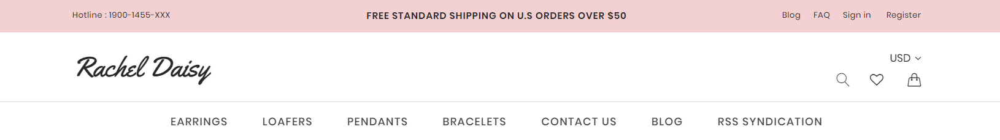

# Customization

This page will explain all configuration available and how to edit each section appear on theme. Let's view the first homepage.


## Top Banner


The top banner can be showed / edited in admin page > __Marketing__ > __Banners__. When you add / edit remember to choose __Location__ is __Top of Page__.

### Colors Customization

To customize colors of this section, go to admin page > __Storefront Design__ > __My Themes__, click button __Customize__ of the current theme to open the Theme Editor. 


Look into the options showing below:


## Header

### Header Styles
This theme support 3 different header styles:
- Logo at left
- Logo at right
- Logo at center




To configure, open the __Theme Editor__, scroll down to section __Logo__, click to expand the logo options. Choose a certain option of __Logo position__, then click __Refresh__ button appear after.


### Edit 3 info text blocks


Show or hide these text blocks in Theme Editor > __Header__ section as showing below: 


Edit content in the language file, from admin page > __Storefront Design__ > __My Themes__, click button __Advanced__ > __Edit Theme Files__ of the current theme:


From the left navigation, click to edit the language file (e.i `en.json`):


Edit the text as figured above.


### Colors Customization

To customize colors of the header section, look into the options showing below in the Theme Editor:


## Mega Menu


Images or labels appear on the mega menu can be edited in the language file `en.json`:


For example if the current menu __Shop By__ has category ID = `23`.

- `"show_cat_image_23": "yes"`: specify an image will show on this menu.
- `cat_image_23`: is the image URL.

If you want to show a label beside a menu items like above image, for example the menu item __Season__ has category ID = `28`:

- `"show_item_label_28": "yes"`: specify a label will show beside this menu item.
- `"item_label_28"`: is the label text.

You can add more for other items as you want.


## Main Slideshow / Carousel

### Edit the slideshow

Edit the slideshow in admin page > __Storefront Design__ > __Design Options__:


### Change position of text content

The theme supports showing slideshow content like heading, text, button on __left__, __right__ or __center__ of the image. To configure this option, open Theme Editor, Look into section Carousel, click to expand:


Choose position of each slide you want to change.

### Colors Customization

To customize color of the slideshow's elements, look into section __Carousel__ in the Theme Editor:


### Hide the slideshow

To hide the slideshow on homepage, uncheck on the checkbox __Show Carousel__ in section __Carousel__ of the Theme Editor.


## 3 Banners


To edit content and images of 3 banners, edit the language file `en.json` as showing below:


If you don't want to show any elements of a banner, for example the button, leave the value __a single space__ character. Example: `"button": " "`.


## New / Featured / Popular Products

The theme supports 3 layout type of New Products, Featured Products and Popular Products blocks:

__Grid__:


__List__:


__Carousel__:


### Configure a Layout Type of products block & Number of Products to show up

In the __Theme Editor__ > __Homepage__, look into __New Products__ section (or __Featured Products__, __Most Popular Products__):

- __Display type__: Choose appropriate layout type (__Grid__, __List__ or __Carousel__).
- __Number of Products__: Choose number of products to show up.


### Show/Hide Quickview button

When hover on a product item, Quickview button is showed up by default. To disable this feature, uncheck the checkbox __Show Quickview__ in the __Theme Editor__ > __Products__ section.


### Change colors and image sizes

In the __Theme Editor__ > __Products__ section, Look into the color options below __Product cards__, __Product Sale Badges__, __Product cards (Quick search)__ and __Image sizes__'s options.


### Change the heading text

To change the heading text (New Products, Featured Products, Most Popular Products), edit the language file, look for the key `products` > `new` or `featured` or `top`.


### Change background of featured products block


#### Method 1: 

To replace this background with our own image, in [Edit Theme Files](quickstart.md#edit-template-files) you can overwrite image file `assets/img/categories-featured-bg.jpg` with your own.

#### Method 2:

To completely remove it, add the CSS code below to `assets/scss/_theme-custom.scss`:

```css
.emthemesModez-productsVerticalCategoriesAside-outer--1 {
  background-image: none;
}
```


### Show products grid with first product show bigger

In theme style LaParis III, the homepage shows new products like below:


This can be accomplished by the code in homepage template file `templates/components/emthemes-modez/home/laparis3.html`:

```
{{> components/emthemes-modez/sections/section section="new_products" style="laparis1"}}
```

Note the difference is `style="laparis1"`.


### Show products carousel fullwidth and having subheading

In theme style LaParis IV, the homepage shows featured products like below:


This can be accomplished by the code in homepage template file `templates/components/emthemes-modez/home/laparis4.html`:

```
{{> components/emthemes-modez/sections/section section="featured_products" style="laparis4" show_subheading=true}}
```

- `style="laparis4"` indicates that products carousel should show full width.
- `show_subheading=true` indicates that the products block should have subheading.

Subheading can be edited in the language file `en.json`:


## Recent Blog Posts


This block show the most recent blog posts.

### Customize heading text and other text

To change the heading text, read more text and date format, edit the language file. Find the key `blog` > `recent_posts`, `posted_by` and `read_more`, edit its values as you want.


## Image Carousel


To edit image and links in this image carousel section, edit the language file, find key `emthemesmodez` > `image_carousel`


- `image*`: is link to the image.
- `title*`: is image text description.
- `url*`: is image link. Leave a single space letter in the value if you want to hide any image.


## Instagram Photos


### Get your own User ID, Client ID, Access Token

In order to display your Instagram photos on your website, you will need to get the __User ID__, __Client ID__ and __Access Token__ from __Instagram Developer__ portal.

#### 1. Create your own Client ID

Open the URL <https://www.instagram.com/developer/> in your browser.

Login to your Instagram account.

Click button __Register Your Application__: 


Click button __Register a New Client__: 


Enter all required info on the form. 


Note that __Valid redirect URIs__ should be exactly `http://127.0.0.1` as recommended as it will be used in the next step.

After submitting the form you will get back to the previous page with a new __Client ID__ is created.


Save this __Client ID__ value, it will be used to configure the Instagram Photos block.

#### 2. Retrieve your Access Token

Click button __Manage__ on your the client app created previously. Open __Security__ tab, uncheck __Disable Implicit OAuth__ checkbox:


Click __Update Client__ button to complete.

Now open your web browser with the URL: 

```plain
https://api.instagram.com/oauth/authorize/?client_id=CLIENT-ID&redirect_uri=http://127.0.0.1&response_type=token
```

where `CLIENT-ID` is replaced by your __Client ID__ number created previously.

Click __Authorize__ button to grant access permission:


Instagram will redirect you to an error page with the URL similiar: 


The text after `access_token=` is the __Access Token__ you want to get. Save it for the next step.

#### 3. Retrieve your User ID

Open the link below on your web browser:

```plain
https://api.instagram.com/v1/users/self/?access_token=ACCESS-TOKEN
```
Where `ACCESS-TOKEN` is replaced by your real __Access Token__ just received previously.


The number in `"id": "..."` is your __User ID__.

### Display your Instagram photos

To display our own Instagram photos, edit the language file. Find the key `emthemesmodez` > `instagram`, input your real code:

- `user_id`: Is your Instagram __User ID__.
- `client_id`: is your Instagram __Client ID__.
- `access_token`: is your Instagram __Access Token__.
- `title`: Is the heading text.


## LaParis II - Products By Category


This section allows you to show products in a certain category. To configure it edit the language file. File keys `emthemesmodez` > `products_by_category`.


- `category_id_*`: is the product category ID that products belong.
- `image_*`: is the image URL to show up beside the products.
- `heading_*`: The heading text on the banner beside.
- `text_*`: Description text on the banner beside.
- `banner_*`: Button text on the banner beside
- `style_*`: `" "` or `"right"` to show banner on left or right.

Theme supports up to 3 products by category blocks.


## LaParis II - Images Carousel


To configure this image carousel, edit the lagnuage file, find keys `emthemesmodez` > `image_carousel`:


- `image_*`: Slide image URL. Leave a single space letter if not use.
- `image_alt_*`: image alt text.
- `url_*`: link URL.
- `heading_*`: Heading text. Leave a single space letter to hide.
- `text_*`: Description text. Leave a single space letter to hide.
- `button_*`: Button text. Leave a single space to hide.

Theme supports up to 5 images in this section. 


## LaParis II - New / Featured / Bestselling Columns


This section show new products, featured products and bestselling products in 3 columns.

You can configure number of products to display in __Theme Editor__ > __Homepage__ section:


You can change the heading text of each column in the language files, find and edit keys `products` > `new`, `products` > `featured`, `products` > `top`.


## LaParis III - First Banner Group


To edit 2 banner, edit the language file `en.json`:


Group `laparis2_1` is coresponding to the block:

```
{{> components/emthemes-modez/sections/section section="banner_laparis2_1"}}
```

In the homepage template file `templates/components/emthemes-modez/home/laparis3.html`.

You can add up to 3 of this banner group.


## LaParis III - Second Banner Group


To edit 3 banner, edit the language file `en.json`:


Group `laparis3_1` is coresponding to the block:

```
{{> components/emthemes-modez/sections/section section="banner_laparis3_1"}}
```

In the homepage template file `templates/components/emthemes-modez/home/laparis3.html`.

You can add up to 3 of this banner group.


## LaParis III - Third Banner Group


To edit this banner, edit the language file `en.json`:


Group `laparis4_1` is coresponding to the block:

```
{{> components/emthemes-modez/sections/section section="banner_laparis4_1"}}
```

In the homepage template file `templates/components/emthemes-modez/home/laparis3.html`.

You can add up to 3 of this banner group.


## LaParis IV - Introduction Text

In theme style LaParis IV:


This text block can be edited in in the language file `en.json` as showing below:


You can find the code output this block in homepage template file `templates/components/emthemes-modez/home/laparis4.html`:

```
{{> components/emthemes-modez/sections/section section="text_1"}}
```

You can add up to 3 instance of this block:

```
{{> components/emthemes-modez/sections/section section="text_1"}}
{{> components/emthemes-modez/sections/section section="text_2"}}
{{> components/emthemes-modez/sections/section section="text_3"}}
```

Coresponding to 3 groups in the language file: `text_1`, `text_2` and `text_3`.


## LaParis IV - 5 Banner Groups


5 banner groups can be edited in the language file `en.json` as showing below:


`laparis5_1` to `laparis5_5` corresponding to first banner group to 5th banner group.

You can find the code output these banner groups in the homepage template file `templates/components/emthemes-modez/home/laparis4.html`:

```
{{> components/emthemes-modez/sections/section section="banner_laparis5_1"}}
{{> components/emthemes-modez/sections/section section="banner_laparis5_2"}}
{{> components/emthemes-modez/sections/section section="banner_laparis5_3" style="alt"}}
{{> components/emthemes-modez/sections/section section="banner_laparis5_4"}}
...
{{> components/emthemes-modez/sections/section section="banner_laparis5_5"}}
```

`style="alt"` indicates 3rd banner group has different sttyle (the first banner has text align right).


## LaParis IV - Video Block

Video block showing on homapge of theme style LaParis IV:


This block can be edited in in the language file `en.json` as showing below:


You can find the code output this block in homepage template file `templates/components/emthemes-modez/home/laparis4.html`:

```
{{> components/emthemes-modez/sections/section section="video_1"}}
```


## Footer - Newsletter


### Change text

To change text appear on this section you can edit the language file as instruction below:

From admin page > __Storefront Design__ > __My Themes__, click button __Advanced__ > __Edit Theme Files__ of the current theme:


From the left navigation, click to edit the language file (e.i `en.json`):


See the section `Newsletter` you can edit as you want:


### Colors Customization

To customize colors of the header section, look into the options showing below in the __Theme Editor__ > __Footer__:


## Footer - Links


To edit text and links on the footer, edit the language file, section `footer` > `links`:


- `col1_heading`, `col2_heading`, `col3_heading`: is the heading text of each column.
- `col*_url*`, `col*_title*`: is URL and text of each link.


## Social Media Icons


To show social icons in the footer, open __Theme Editor__ > __Social Media Icons__ section, set __Bottom Placement__ = `Right`. 

Note: You will need to configure which icons to appear in admin panel > __Storefront Design__ > __Design Options__, input your social links in __Social Media__ section.


## Payment Icons


To show/hide payment icons, go to Theme __Editor__ > __Payment Icons__ secitons, check or uncheck any icons you want to show or hide.


## Copyright Links


To edit links in the copyright section at footer, edit the language file, find `footer` > `copyright_links`:


- `url*` is link URL. Leave a __single space__ letter if you want to hide any link.
- `title*` is link title.


## Credit Links


To show/hide the credit links, go to Theme Editor > __Footer__ section, tick or untick the checkboxes as showing above.


## Assign different product layout to a specific product page

Theme has 2 product layouts: __default__ and __Fullwith with Lightbox__.

Product layout fullwidth:


To assign a product layout, edit your product in the admin panel. In tab __Order Details__, choose __Template Layout File__ with the layout out want:


## Assign different category layout to a specific category page

Theme has 2 category layout: __default__ and __Fullwidth__.

Category layout fullwidth:


To assign a category layout, edit your category in the admin panel. Choose __Template Layout File__ with the layout out want:


## Show custom product labels


Turn on displaying product labels in the __Theme Editor__ > __Products__ section, tick on the checkbox __Show custom label using custom field 'card_label'__ and choose __Display Product Sale Badges__ as __Top Left__.


Edit your product in the admin panel to add custom label:


Add a custom label named `card_label` and enter label text in the value input box.


## Show color swatches on product card:


To display color watches on product card, open __Theme Editor__ > __Products__ section, tick on the checkbox __Show color swatches using custom field 'card_color'__.


Edit your product in the admin panel to add custom label:


Add a custom label named `card_color` and enter color hex code in the value input box seperator by commas.


## Mix contents from other theme styles

For example, if you want to use theme __default__ style as the main theme, but also want to display other content blocks from __LaParis II__ style. You can edit the template files, rearrange, add more content blocks or delete unused content blocks.

Let open folder `templates` > `components` > `emthemes-modez` > `home` in the template files editor:


There is 2 files in this folder:

- `default.html`: is used for __default__ style.
- `laparis2.html`: is used for __LaParis II__ style.

Let's take a look at contents of 2 files:

__default.html__

```plain
{{> components/emthemes-modez/sections/section section="banner_laparis1_1"}}
{{> components/emthemes-modez/sections/section section="new_products"}}
{{> components/emthemes-modez/sections/section section="categories_featured"}}
{{> components/emthemes-modez/sections/section section="popular_products"}}
{{> components/emthemes-modez/sections/section section="blog_recent"}}
{{> components/emthemes-modez/sections/section section="brands_carousel"}}
{{> components/emthemes-modez/sections/section section="instagram_grid"}}
```

__laparis2.html__

```plain
{{> components/emthemes-modez/sections/section section="products_by_category_1"}}
{{> components/emthemes-modez/sections/section section="products_by_category_2"}}
{{> components/emthemes-modez/sections/section section="carousel_laparis2_1"}}
{{> components/emthemes-modez/sections/section section="special_products_columns"}}
{{> components/emthemes-modez/sections/section section="brands_carousel"}}
{{> components/emthemes-modez/sections/section section="instagram_grid"}}
```

The files are showing very clearly how content blocks are displayed. See values in parameter `section="..."`:

- `banner_laparis1_1`: Is the first block content 3 banners in the homepage of default style.
- `new_products`: Is a block contains new products.
- `categories_featured`: Is a block contains featured products with categories list as appeared on the homepage of default style.
- `popular_products`: Is a block contains popular (or bestselling) products.
- `blog_recent`: Is a block contains recent blog posts.
- `brands_carousel`: Is a brand images carousel.
- `instagram_grid`: Is a block displaying instagram photos.
- `products_by_category_1` & `products_by_category_2`: Is a block contains product in a certain category as showing on homepage of LaParis II style.
- `carousel_laparis2_1`: Is the image carousel as showing on homepage of LaParis II style.
- `special_products_columns`: Is a block contains 3 columns showing new products, featured products and bestselling products as displayed on homepage of LaParis II style.

So just copy a line from the other file to the other. Arrange position of these sections as you wish.

Example of a mixed __default.html__:

```plain
{{> components/emthemes-modez/sections/section section="new_products"}}
{{> components/emthemes-modez/sections/section section="popular_products"}}
{{> components/emthemes-modez/sections/section section="banner_laparis1_1"}}
{{> components/emthemes-modez/sections/section section="products_by_category_1"}}
{{> components/emthemes-modez/sections/section section="products_by_category_2"}}
{{> components/emthemes-modez/sections/section section="instagram_grid"}}
{{> components/emthemes-modez/sections/section section="blog_recent"}}
{{> components/emthemes-modez/sections/section section="brands_carousel"}}
```

## Add our own CSS (Sass) code

To add your own custom CSS code you can edit the file `assets/scss/_theme-custom.scss_` in __Edit Theme Files__ editor:


__Note: __

- Copy / backup this file for future theme upgrade.
- Add custom CSS code required CSS (or Sass) programming skill. It's not recommended for new users.
